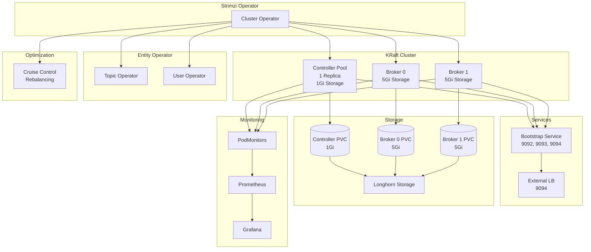
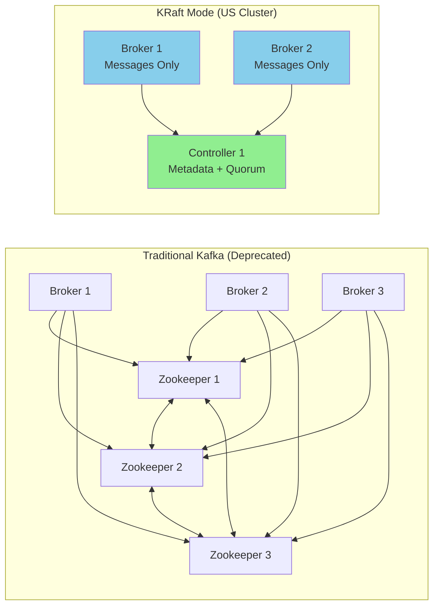
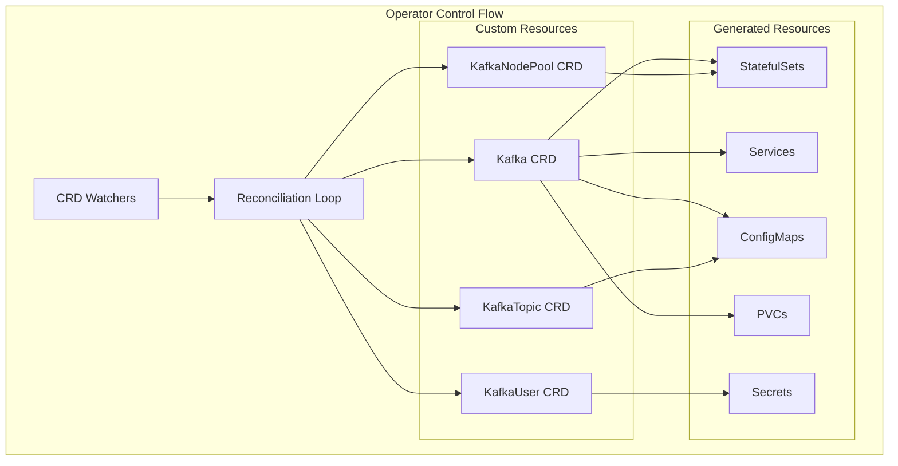
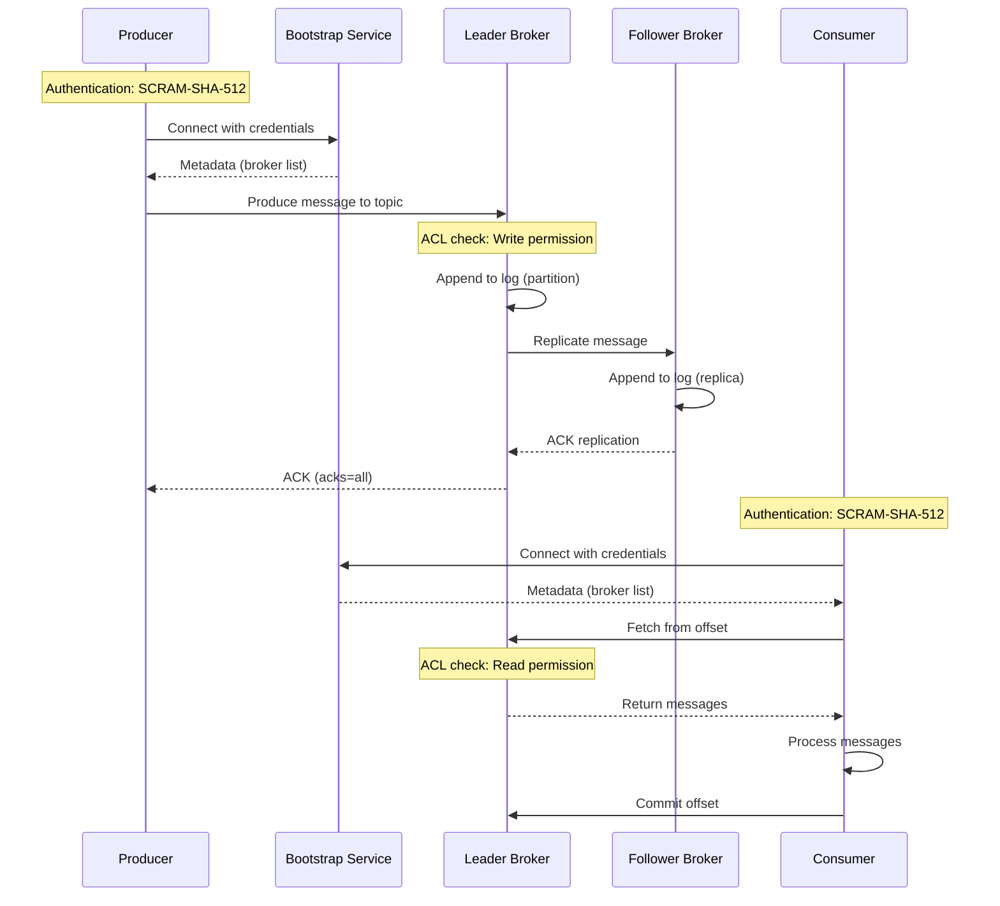
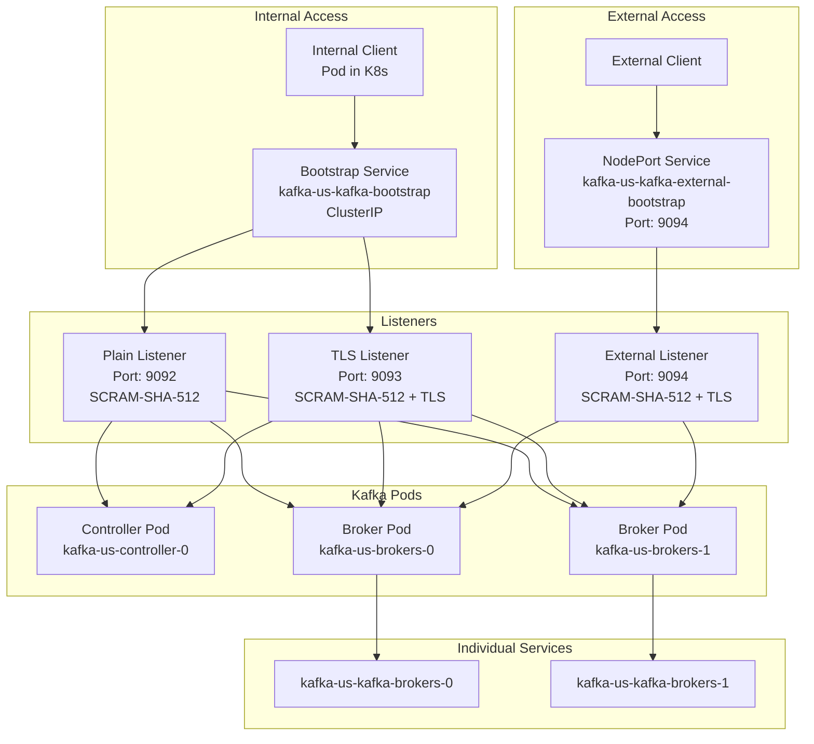
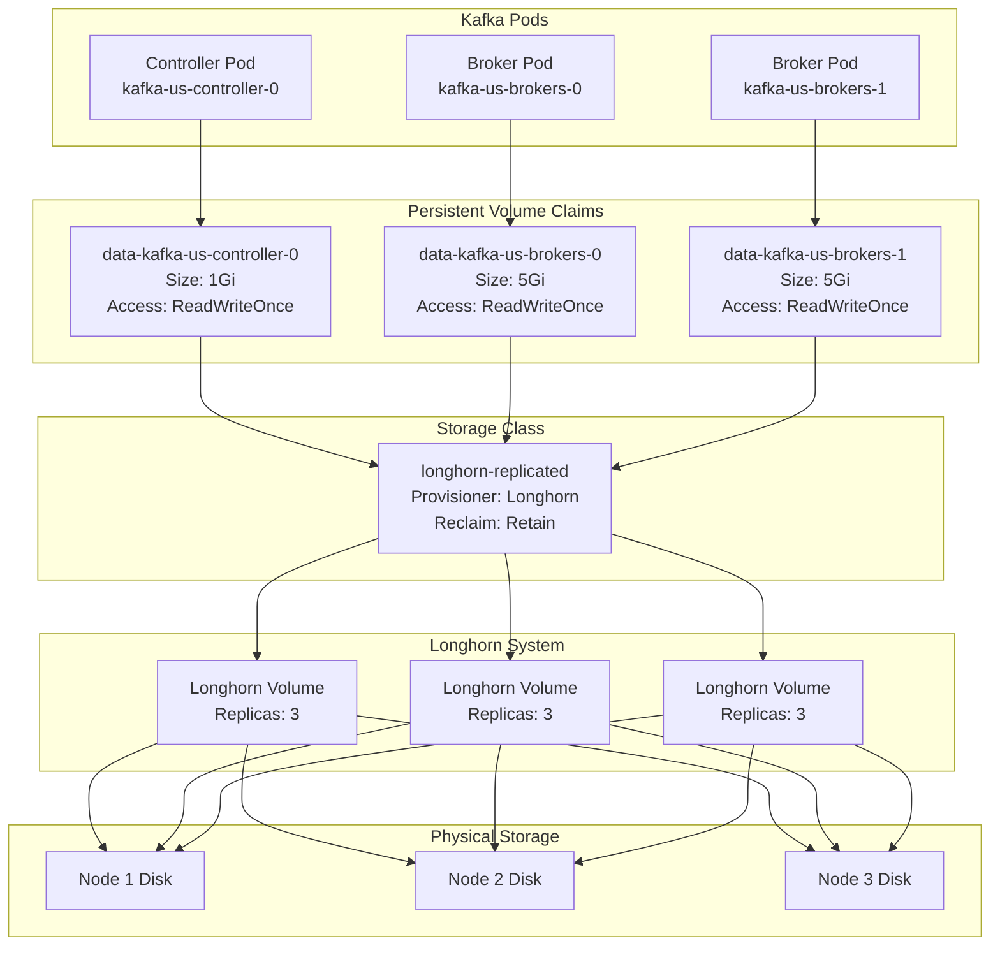
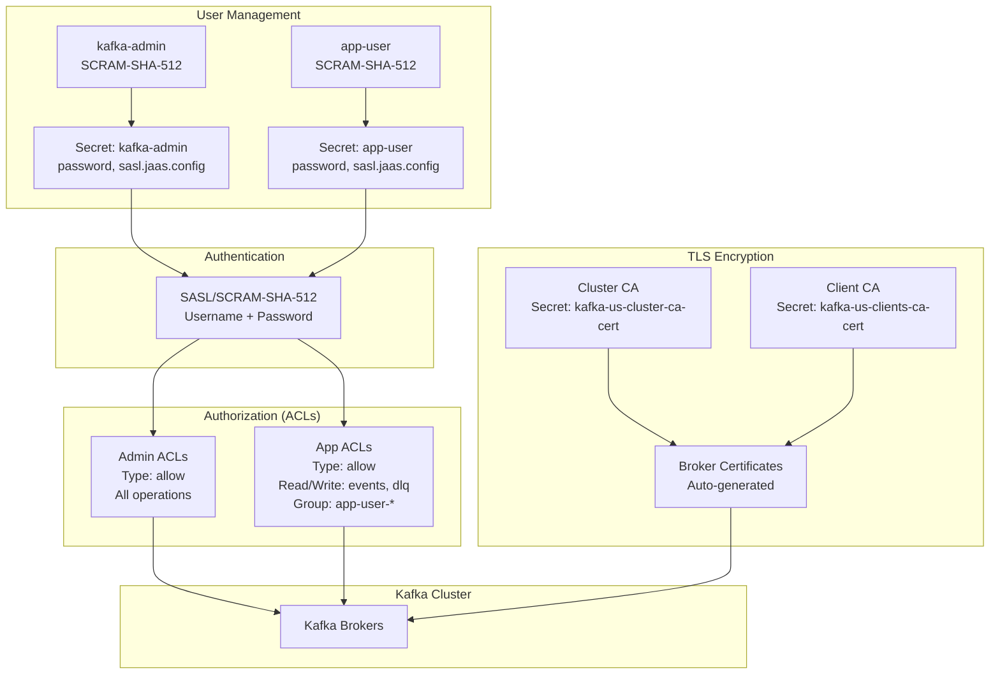
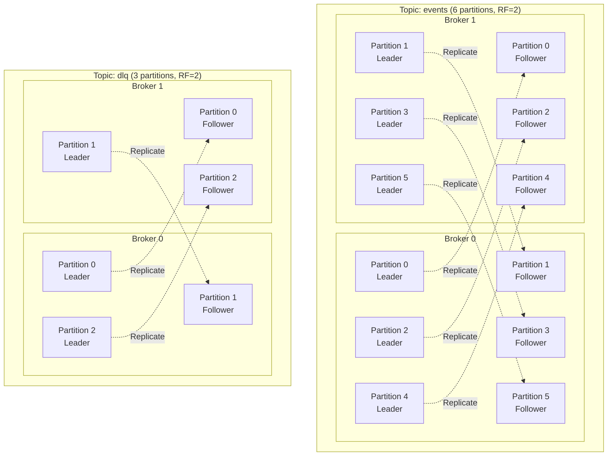
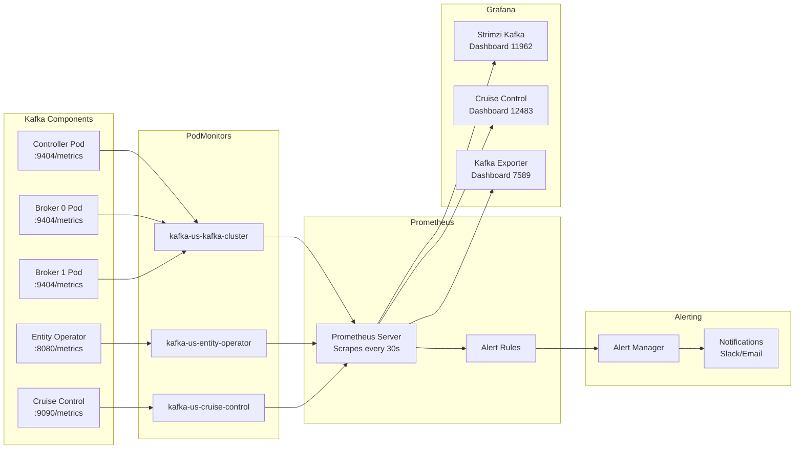

# Kafka Architecture - US Cluster

Apache Kafka deployment using Strimzi Operator in KRaft mode on the US cluster.

Last Updated: 2026-01-24

## Table of Contents

- [Overview](#overview)
- [Architecture Overview](#architecture-overview)
- [KRaft Mode Architecture](#kraft-mode-architecture)
- [Component Deep Dive](#component-deep-dive)
- [Data Flow](#data-flow)
- [Network Architecture](#network-architecture)
- [Storage Architecture](#storage-architecture)
- [Security Architecture](#security-architecture)
- [Topic Architecture](#topic-architecture)
- [Monitoring Architecture](#monitoring-architecture)
- [Configuration Reference](#configuration-reference)
- [Operational Guide](#operational-guide)
- [Troubleshooting](#troubleshooting)

## Overview

The US cluster runs a production-ready Kafka deployment using Strimzi Operator with KRaft mode (no Zookeeper dependency). The architecture is designed for high availability, security, and performance.

### Quick Reference

| Property            | Value                |
| ------------------- | -------------------- |
| Namespace           | `kafka`              |
| Cluster Name        | `kafka-us`           |
| Kafka Version       | 4.1.1                |
| Metadata Version    | 4.1-IV1              |
| Strimzi Version     | 0.50.0               |
| Mode                | KRaft (no Zookeeper) |
| Controller Replicas | 1                    |
| Broker Replicas     | 2                    |
| Storage Class       | longhorn-replicated  |
| Status              | Active               |

## Architecture Overview

### High-Level Architecture



### Key Components

| Component             | Purpose                            | Replicas | Resources               |
| --------------------- | ---------------------------------- | -------- | ----------------------- |
| **Strimzi Operator**  | Manages Kafka CRDs                 | 1        | Cluster-wide            |
| **KRaft Controllers** | Cluster metadata & consensus       | 1        | 1Gi storage             |
| **Kafka Brokers**     | Message handling & replication     | 2        | 5Gi storage each        |
| **Topic Operator**    | Automates topic management         | 1        | Part of Entity Operator |
| **User Operator**     | Automates user/ACL management      | 1        | Part of Entity Operator |
| **Cruise Control**    | Cluster optimization & rebalancing | 1        | Embedded                |

## KRaft Mode Architecture

### KRaft vs Zookeeper Comparison



### Why KRaft?

**Benefits of KRaft Mode:**

1. **Simplified Architecture**
   - Eliminates Zookeeper dependency (3-5 fewer nodes)
   - Reduces operational complexity
   - Fewer moving parts to manage and monitor

2. **Better Performance**
   - Faster controller failover (seconds vs minutes)
   - Reduced latency for metadata operations
   - More efficient leader election

3. **Improved Scalability**
   - Support for millions of partitions
   - Better metadata handling at scale
   - Reduced network overhead

4. **Enhanced Security**
   - Single security model (no separate Zookeeper ACLs)
   - Unified authentication and authorization
   - Simpler certificate management

5. **Future-Proof**
   - Apache Kafka 3.x+ default mode
   - Zookeeper mode deprecated in Kafka 4.0

**US Cluster Configuration:**

- 1 dedicated controller for metadata management
- 2 brokers for message handling
- Combined mode available but separated for clarity

## Component Deep Dive

### Strimzi Kafka Operator



**Key Responsibilities:**

- Watches Kafka custom resources (CRDs)
- Generates and maintains Kubernetes resources (StatefulSets, Services, ConfigMaps)
- Handles rolling updates and configuration changes
- Manages TLS certificates and secrets
- Coordinates cluster scaling and upgrades

### Controllers

**Role:** KRaft controllers manage cluster metadata and consensus (replacing Zookeeper).

**Configuration:**

```yaml
- name: controller
  replicas: 1
  resources:
    requests:
      memory: 512Mi
      cpu: 200m
    limits:
      memory: 1Gi
      cpu: 500m
  storage:
    type: persistent-claim
    size: 1Gi
    class: longhorn-replicated
```

**Responsibilities:**

- Cluster metadata management (topics, partitions, replicas)
- Controller election and failover
- Partition leader election
- Configuration changes coordination

**High Availability Note:**

- Current: 1 controller (acceptable for dev/staging)
- Production recommendation: 3 controllers for HA
- Must always be an odd number (1, 3, 5, 7)

### Brokers

**Role:** Handle all message production, consumption, and replication.

**Configuration:**

```yaml
- name: brokers
  replicas: 2
  resources:
    requests:
      memory: 2Gi
      cpu: 500m
    limits:
      memory: 4Gi
      cpu: 1000m
  storage:
    type: persistent-claim
    size: 5Gi
    class: longhorn-replicated
```

**Responsibilities:**

- Accept producer messages
- Store messages in topic partitions
- Serve consumer requests
- Replicate partitions across brokers
- Handle partition leadership

**Scaling Considerations:**

- Current: 2 brokers (minimum for replication factor 2)
- Can scale horizontally by increasing replicas
- Automatic rebalancing via Cruise Control
- Each broker gets dedicated PVC

### Entity Operator

**Topic Operator:**

- Manages KafkaTopic CRDs
- Creates/updates/deletes topics automatically
- Ensures topic configuration matches CRD spec
- Handles partition count and replication factor changes

**User Operator:**

- Manages KafkaUser CRDs
- Creates SCRAM-SHA-512 credentials
- Configures ACLs (Access Control Lists)
- Stores credentials in Kubernetes Secrets

**Configuration:**

```yaml
entityOperator:
  topicOperator:
    resources:
      requests:
        memory: 128Mi
        cpu: 100m
  userOperator:
    resources:
      requests:
        memory: 128Mi
        cpu: 100m
```

### Cruise Control

**Purpose:** Automated cluster optimization and rebalancing.

**Capabilities:**

- Monitors cluster load and partition distribution
- Automatically rebalances partitions across brokers
- Optimizes resource utilization (CPU, disk, network)
- Provides anomaly detection
- Supports manual rebalancing operations

**Configuration:**

```yaml
cruiseControl:
  resources:
    requests:
      memory: 512Mi
      cpu: 200m
    limits:
      memory: 1Gi
      cpu: 500m
```

**Key Features:**

- Goal-based optimization (disk usage, network I/O, CPU)
- Self-healing capabilities
- Supports broker addition/removal
- REST API for manual interventions

## Data Flow

### Message Flow Architecture



**Flow Steps:**

1. **Producer Authentication**
   - Producer connects to bootstrap service
   - Authenticates using SCRAM-SHA-512
   - Receives cluster metadata

2. **Message Production**
   - Producer sends message to partition leader
   - Leader checks ACLs for Write permission
   - Message appended to leader's log
   - Replicated to follower brokers (ISR - In-Sync Replicas)
   - Leader waits for min.insync.replicas ACKs
   - ACK sent back to producer (based on acks setting)

3. **Consumer Authentication**
   - Consumer connects to bootstrap service
   - Authenticates using SCRAM-SHA-512
   - Receives cluster metadata

4. **Message Consumption**
   - Consumer fetches from partition leader
   - Leader checks ACLs for Read permission
   - Messages returned to consumer
   - Consumer processes and commits offset

**Replication Process:**

- Replication Factor: 2 (each partition has 2 copies)
- ISR (In-Sync Replicas): All replicas up-to-date with leader
- Leader election: Automatic on broker failure
- min.insync.replicas: Minimum replicas required for write

## Network Architecture

### Network Diagram



### Listeners Configuration

**1. Plain Listener (Port 9092)**

- Protocol: PLAINTEXT with SASL
- Authentication: SCRAM-SHA-512
- Use case: Internal services requiring auth but not TLS
- Access: Within Kubernetes cluster only

**2. TLS Listener (Port 9093)**

- Protocol: SASL_SSL
- Authentication: SCRAM-SHA-512
- Encryption: TLS 1.2+
- Use case: Secure internal communication
- Access: Within Kubernetes cluster only

**3. External Listener (Port 9094)**

- Protocol: SASL_SSL
- Authentication: SCRAM-SHA-512
- Encryption: TLS 1.2+
- Type: NodePort
- Use case: External client access
- Access: Outside Kubernetes cluster

### Services

```bash
# Bootstrap Service (ClusterIP)
kafka-us-kafka-bootstrap.kafka.svc.cluster.local
  - Port 9092: Plain + Auth
  - Port 9093: TLS + Auth

# External Service (NodePort)
kafka-us-kafka-external-bootstrap.kafka.svc.cluster.local
  - Port 9094: TLS + Auth (external access via NodePort)

# Individual Broker Services (NodePort)
kafka-us-kafka-brokers-0.kafka.svc.cluster.local
kafka-us-kafka-brokers-1.kafka.svc.cluster.local
  - Port 9092: Plain
  - Port 9093: TLS
  - NodePorts for direct broker access
```

### Connection Strings

**Internal (from within Kubernetes):**

```properties
# Plain + Auth
bootstrap.servers=kafka-us-kafka-bootstrap.kafka.svc.cluster.local:9092

# TLS + Auth (recommended)
bootstrap.servers=kafka-us-kafka-bootstrap.kafka.svc.cluster.local:9093
security.protocol=SASL_SSL
sasl.mechanism=SCRAM-SHA-512
sasl.jaas.config=org.apache.kafka.common.security.scram.ScramLoginModule required \
  username="app-user" \
  password="<from-secret>";
```

**External:**

```bash
# Get external IP/hostname
kubectl get svc kafka-us-kafka-external-bootstrap -n kafka

# Connect from outside cluster
bootstrap.servers=<external-ip>:9094
security.protocol=SASL_SSL
sasl.mechanism=SCRAM-SHA-512
```

## External Access from Local Machine

### Connection Details

The Kafka cluster is accessible from the internet via NodePort services:

| Property | Value |
|----------|-------|
| Bootstrap Server | `vps27.canhnv.com:32455` |
| Alternative Bootstrap | `vps40.canhnv.com:32455` |
| Broker 0 | `vps40.canhnv.com:30568` |
| Broker 1 | `vps27.canhnv.com:30899` |
| Security Protocol | SASL_SSL |
| SASL Mechanism | SCRAM-SHA-512 |
| Username | `kafka-admin` or `app-user` |

### Prerequisites

1. **Extract CA Certificate:**
   ```bash
   mkdir -p ~/kafka-certs
   kubectl config use-context us
   kubectl get secret kafka-us-cluster-ca-cert -n kafka -o jsonpath='{.data.ca\.crt}' | base64 -d > ~/kafka-certs/kafka-us-cluster-ca.crt
   ```

2. **Get Password:**
   ```bash
   kubectl get secret kafka-admin -n kafka -o jsonpath='{.data.password}' | base64 -d && echo
   ```

### Connect with kcat

```bash
# Set password
export KAFKA_ADMIN_PASSWORD=$(kubectl get secret kafka-admin -n kafka -o jsonpath='{.data.password}' | base64 -d)

# List topics
kcat -L -b vps27.canhnv.com:32455 \
  -X security.protocol=SASL_SSL \
  -X sasl.mechanism=SCRAM-SHA-512 \
  -X sasl.username=kafka-admin \
  -X sasl.password="$KAFKA_ADMIN_PASSWORD" \
  -X ssl.ca.location=$HOME/kafka-certs/kafka-us-cluster-ca.crt

# Produce message
echo "test message" | kcat -P -b vps27.canhnv.com:32455 -t events \
  -X security.protocol=SASL_SSL \
  -X sasl.mechanism=SCRAM-SHA-512 \
  -X sasl.username=kafka-admin \
  -X sasl.password="$KAFKA_ADMIN_PASSWORD" \
  -X ssl.ca.location=$HOME/kafka-certs/kafka-us-cluster-ca.crt

# Consume messages
kcat -C -b vps27.canhnv.com:32455 -t events -o beginning \
  -X security.protocol=SASL_SSL \
  -X sasl.mechanism=SCRAM-SHA-512 \
  -X sasl.username=kafka-admin \
  -X sasl.password="$KAFKA_ADMIN_PASSWORD" \
  -X ssl.ca.location=$HOME/kafka-certs/kafka-us-cluster-ca.crt
```

### Connect with Node.js (kafkajs)

```javascript
const { Kafka } = require('kafkajs');
const fs = require('fs');

const kafka = new Kafka({
  clientId: 'my-app',
  brokers: ['vps27.canhnv.com:32455'],
  ssl: {
    rejectUnauthorized: true,
    ca: [fs.readFileSync('/path/to/kafka-us-cluster-ca.crt', 'utf-8')],
  },
  sasl: {
    mechanism: 'scram-sha-512',
    username: 'kafka-admin',
    password: process.env.KAFKA_ADMIN_PASSWORD,
  },
});
```

### Connect with Python (confluent-kafka)

```python
from confluent_kafka import Consumer, Producer

config = {
    'bootstrap.servers': 'vps27.canhnv.com:32455',
    'security.protocol': 'SASL_SSL',
    'sasl.mechanism': 'SCRAM-SHA-512',
    'sasl.username': 'kafka-admin',
    'sasl.password': os.environ['KAFKA_ADMIN_PASSWORD'],
    'ssl.ca.location': '/path/to/kafka-us-cluster-ca.crt',
    'group.id': 'my-consumer-group',
}
```

### Local Connection Files

Connection helper files are available at `~/kafka-certs/`:
- `kafka-us-cluster-ca.crt` - TLS CA certificate
- `kafka-us-env.sh` - Environment variables (source before use)
- `connect-kafka-us.sh` - Helper script with examples

## Storage Architecture

### Storage Diagram



### Storage Configuration

**PVC Details:**

```yaml
# Controller Storage
- Size: 1Gi (metadata only)
- Access Mode: ReadWriteOnce
- Storage Class: longhorn-replicated

# Broker Storage
- Size: 5Gi per broker (message data)
- Access Mode: ReadWriteOnce
- Storage Class: longhorn-replicated
```

**Longhorn Integration:**

- Replication: 3 replicas per volume
- Data locality: Best-effort
- Automatic failover on node failure
- Snapshot support for backups
- Volume expansion supported

**Retention Policy:**

- PVCs persist after pod deletion
- Manual cleanup required
- Reclaim policy: Retain (prevents accidental data loss)

### Storage Best Practices

1. **Monitoring:**
   - Watch PVC usage: `kubectl top pvc -n kafka`
   - Set alerts for 80% capacity
   - Monitor Longhorn volume health

2. **Capacity Planning:**
   - Calculate: (messages/day × avg size × retention days) × safety factor
   - Current broker capacity: 5Gi each (10Gi total)
   - Controller needs minimal space (metadata only)

3. **Scaling Storage:**

   ```bash
   # Expand PVC (requires storage class support)
   kubectl patch pvc data-kafka-us-brokers-0 -n kafka \
     -p '{"spec":{"resources":{"requests":{"storage":"10Gi"}}}}'
   ```

## Security Architecture

### Security Diagram



### Authentication: SCRAM-SHA-512

**Why SCRAM-SHA-512?**

- Strong cryptographic hash function (SHA-512)
- Password never transmitted in plaintext
- Challenge-response mechanism
- Resistant to replay attacks
- Built into Kafka (no external dependencies)

**User Creation:**

```yaml
apiVersion: kafka.strimzi.io/v1beta2
kind: KafkaUser
metadata:
  name: app-user
  labels:
    strimzi.io/cluster: kafka-us
spec:
  authentication:
    type: scram-sha-512 # Password stored hashed
```

**Generated Secret:**

```bash
kubectl get secret app-user -n kafka -o yaml
```

Contains:

- `password`: Base64-encoded password
- `sasl.jaas.config`: Complete JAAS config for clients

### Authorization: ACLs (Access Control Lists)

**Admin User ACLs:**

```yaml
authorization:
  type: simple
  acls:
    # Full cluster access
    - resource:
        type: cluster
      operations: [All]
```

**Application User ACLs:**

```yaml
authorization:
  type: simple
  acls:
    # Topic permissions
    - resource:
        type: topic
        name: events
      operations: [Read, Write, Describe]
    - resource:
        type: topic
        name: dlq
      operations: [Read, Write, Describe]
    # Consumer group permissions
    - resource:
        type: group
        name: app-user-
        patternType: prefix
      operations: [Read]
```

**ACL Operations:**

- `Read`: Consume messages
- `Write`: Produce messages
- `Describe`: View topic metadata
- `Create`: Create topics (if auto-create enabled)
- `Delete`: Delete topics
- `Alter`: Modify topic config
- `All`: All operations

### TLS Encryption

**Certificate Hierarchy:**

1. **Cluster CA**: Signs broker certificates
2. **Clients CA**: Signs client certificates (optional, mutual TLS)
3. **Broker Certificates**: Auto-generated and rotated by Strimzi

**TLS Secrets:**

```bash
# Cluster CA certificate (for client trust)
kafka-us-cluster-ca-cert

# Client CA certificate (for mutual TLS)
kafka-us-clients-ca-cert

# Broker certificates (internal)
kafka-us-kafka-brokers
```

**Client Configuration:**

```properties
security.protocol=SASL_SSL
ssl.endpoint.identification.algorithm=https
ssl.truststore.type=PEM
# Extract CA cert from secret for truststore
```

### Security Best Practices

1. **Credential Management:**
   - Store secrets in Kubernetes Secrets (encrypted at rest)
   - Use RBAC to restrict secret access
   - Rotate passwords regularly (recreate KafkaUser CRD)

2. **Network Security:**
   - Use TLS listener (9093) for internal services
   - Restrict external listener (9094) with firewall rules
   - Consider network policies to limit pod-to-pod access

3. **ACL Best Practices:**
   - Principle of least privilege
   - Separate users per application
   - Use prefix patterns for consumer groups
   - Regularly audit ACLs

4. **Certificate Rotation:**
   - Strimzi auto-rotates cluster CA annually
   - Manual rotation supported if needed
   - Zero-downtime rolling update

## Topic Architecture

### Partition Distribution Diagram



### Topic Configuration

**Events Topic:**

```yaml
apiVersion: kafka.strimzi.io/v1beta2
kind: KafkaTopic
metadata:
  name: events
  labels:
    strimzi.io/cluster: kafka-us
spec:
  partitions: 6
  replicas: 2
  config:
    retention.ms: 604800000 # 7 days
    cleanup.policy: delete
    min.insync.replicas: 1
    compression.type: producer
```

**DLQ Topic (Dead Letter Queue):**

```yaml
apiVersion: kafka.strimzi.io/v1beta2
kind: KafkaTopic
metadata:
  name: dlq
  labels:
    strimzi.io/cluster: kafka-us
spec:
  partitions: 3
  replicas: 2
  config:
    retention.ms: 2592000000 # 30 days
    cleanup.policy: delete
    min.insync.replicas: 1
```

### Topic Summary

| Topic  | Partitions | Replication Factor | Retention | Purpose                               |
| ------ | ---------- | ------------------ | --------- | ------------------------------------- |
| events | 6          | 2                  | 7 days    | Application events                    |
| dlq    | 3          | 2                  | 30 days   | Dead letter queue for failed messages |

### Partitioning Strategy

**Why 6 partitions for events?**

- Allows 6 parallel consumers (1 per partition)
- Good balance for current broker count (2)
- Each broker handles 3 leader partitions
- Easy to scale up (add more brokers, rebalance)

**Why 3 partitions for dlq?**

- Lower throughput expected (failed messages)
- Sufficient parallelism for processing
- Reduces rebalancing overhead

**Replication Factor 2:**

- Provides fault tolerance (survives 1 broker failure)
- Minimum for production (1 leader + 1 follower)
- With 2 brokers, RF=2 means all brokers have all data
- Consider RF=3 when scaling to 3+ brokers

### Partition Leadership Distribution

**Cruise Control ensures:**

- Balanced leader distribution across brokers
- Even partition distribution
- Automatic rebalancing on broker addition/removal
- Preferred replica election

**Current Distribution:**

- Broker 0: 3 leaders for events, 2 leaders for dlq
- Broker 1: 3 leaders for events, 1 leader for dlq
- Automatically managed by Kafka controller

## Monitoring Architecture

### Monitoring Diagram



### PodMonitor Configuration

**Cluster Metrics:**

```yaml
apiVersion: monitoring.coreos.com/v1
kind: PodMonitor
metadata:
  name: kafka-us-kafka-cluster
  namespace: kafka
spec:
  selector:
    matchLabels:
      strimzi.io/cluster: kafka-us
      strimzi.io/kind: Kafka
  podMetricsEndpoints:
    - port: metrics
      path: /metrics
      interval: 30s
```

**Entity Operator Metrics:**

```yaml
apiVersion: monitoring.coreos.com/v1
kind: PodMonitor
metadata:
  name: kafka-us-entity-operator
  namespace: kafka
spec:
  selector:
    matchLabels:
      strimzi.io/cluster: kafka-us
      strimzi.io/kind: entity-operator
  podMetricsEndpoints:
    - port: metrics
      interval: 30s
```

### Key Metrics

**Broker Metrics:**

```promql
# Messages in per second
rate(kafka_server_brokertopicmetrics_messagesinpersec[5m])

# Bytes in per second
rate(kafka_server_brokertopicmetrics_bytesinpersec[5m])

# Bytes out per second
rate(kafka_server_brokertopicmetrics_bytesoutpersec[5m])

# Under-replicated partitions (should be 0)
kafka_server_replicamanager_underreplicatedpartitions

# Offline partitions (should be 0)
kafka_controller_kafkacontroller_offlinepartitionscount

# Active controller count (should be 1)
kafka_controller_kafkacontroller_activecontrollercount
```

**JVM Metrics:**

```promql
# Heap memory usage
jvm_memory_bytes_used{area="heap"}

# GC time
rate(jvm_gc_collection_seconds_sum[5m])

# Thread count
jvm_threads_current
```

**Topic Metrics:**

```promql
# Topic size
kafka_log_log_size{topic="events"}

# Log end offset
kafka_log_log_logendoffset{topic="events"}
```

### Grafana Dashboards

**Recommended Dashboards:**

1. **Strimzi Kafka (ID: 11962)**
   - Cluster overview
   - Broker health
   - Topic metrics
   - Consumer lag

2. **Cruise Control (ID: 12483)**
   - Cluster balance
   - Rebalancing status
   - Resource utilization

3. **Kafka Exporter (ID: 7589)**
   - Consumer group lag
   - Partition details
   - Offset monitoring

**Import Command:**

```bash
# In Grafana UI
Dashboards → Import → Enter ID (11962, 12483, 7589)
```

### Alerting Rules

**Critical Alerts:**

```yaml
# Under-replicated partitions
- alert: KafkaUnderReplicatedPartitions
  expr: kafka_server_replicamanager_underreplicatedpartitions > 0
  for: 5m
  annotations:
    summary: Kafka has under-replicated partitions

# No active controller
- alert: KafkaNoActiveController
  expr: kafka_controller_kafkacontroller_activecontrollercount != 1
  for: 1m
  annotations:
    summary: Kafka cluster has no active controller

# Offline partitions
- alert: KafkaOfflinePartitions
  expr: kafka_controller_kafkacontroller_offlinepartitionscount > 0
  for: 1m
  annotations:
    summary: Kafka has offline partitions
```

**Warning Alerts:**

```yaml
# High consumer lag
- alert: KafkaConsumerLagHigh
  expr: kafka_consumergroup_lag > 1000
  for: 10m
  annotations:
    summary: Kafka consumer group has high lag

# Disk usage high
- alert: KafkaDiskUsageHigh
  expr: (kubelet_volume_stats_used_bytes / kubelet_volume_stats_capacity_bytes) > 0.8
  for: 5m
  annotations:
    summary: Kafka broker disk usage above 80%
```

## Configuration Reference

### Cluster Configuration

**Main Kafka Resource:**

```yaml
apiVersion: kafka.strimzi.io/v1beta2
kind: Kafka
metadata:
  name: kafka-us
  namespace: kafka
spec:
  kafka:
    version: 4.1.1
    metadataVersion: 4.1-IV1

    # Listeners
    listeners:
      - name: plain
        port: 9092
        type: internal
        tls: false
        authentication:
          type: scram-sha-512
      - name: tls
        port: 9093
        type: internal
        tls: true
        authentication:
          type: scram-sha-512
      - name: external
        port: 9094
        type: nodeport
        tls: true
        authentication:
          type: scram-sha-512
        configuration:
          bootstrap:
            nodePort: 32455
          brokers:
            - broker: 0
              nodePort: 30568
              advertisedHost: vps40.canhnv.com
            - broker: 1
              nodePort: 30899
              advertisedHost: vps27.canhnv.com

    # Authorization
    authorization:
      type: simple
      superUsers:
        - kafka-admin

    # Configuration
    config:
      auto.create.topics.enable: false
      offsets.topic.replication.factor: 2
      transaction.state.log.replication.factor: 2
      transaction.state.log.min.isr: 1
      default.replication.factor: 2
      min.insync.replicas: 1
      log.retention.hours: 168
      log.segment.bytes: 1073741824
      log.retention.check.interval.ms: 300000

    # Metrics
    metricsConfig:
      type: jmxPrometheusExporter
      valueFrom:
        configMapKeyRef:
          name: kafka-metrics
          key: kafka-metrics-config.yml
```

### Node Pools Configuration

**Controller Pool:**

```yaml
apiVersion: kafka.strimzi.io/v1beta2
kind: KafkaNodePool
metadata:
  name: controller
  namespace: kafka
  labels:
    strimzi.io/cluster: kafka-us
spec:
  replicas: 1
  roles:
    - controller
  storage:
    type: persistent-claim
    size: 1Gi
    class: longhorn-replicated
    deleteClaim: false
  resources:
    requests:
      memory: 512Mi
      cpu: 200m
    limits:
      memory: 1Gi
      cpu: 500m
```

**Broker Pool:**

```yaml
apiVersion: kafka.strimzi.io/v1beta2
kind: KafkaNodePool
metadata:
  name: brokers
  namespace: kafka
  labels:
    strimzi.io/cluster: kafka-us
spec:
  replicas: 2
  roles:
    - broker
  storage:
    type: persistent-claim
    size: 5Gi
    class: longhorn-replicated
    deleteClaim: false
  resources:
    requests:
      memory: 2Gi
      cpu: 500m
    limits:
      memory: 4Gi
      cpu: 1000m
```

### Topics Configuration

**Create Topic:**

```yaml
apiVersion: kafka.strimzi.io/v1beta2
kind: KafkaTopic
metadata:
  name: my-topic
  namespace: kafka
  labels:
    strimzi.io/cluster: kafka-us
spec:
  partitions: 6
  replicas: 2
  config:
    retention.ms: 604800000 # 7 days
    cleanup.policy: delete
    min.insync.replicas: 1
    compression.type: producer
    segment.bytes: 1073741824
    max.message.bytes: 1048576
```

**Topic Configuration Options:**

- `retention.ms`: How long to keep messages (ms)
- `cleanup.policy`: delete or compact
- `min.insync.replicas`: Min replicas for write ACK
- `compression.type`: none, gzip, snappy, lz4, zstd, producer
- `segment.bytes`: Log segment size
- `max.message.bytes`: Max message size

### Users Configuration

**Admin User:**

```yaml
apiVersion: kafka.strimzi.io/v1beta2
kind: KafkaUser
metadata:
  name: kafka-admin
  namespace: kafka
  labels:
    strimzi.io/cluster: kafka-us
spec:
  authentication:
    type: scram-sha-512
  authorization:
    type: simple
    acls:
      - resource:
          type: cluster
        operations: [All]
```

**Application User:**

```yaml
apiVersion: kafka.strimzi.io/v1beta2
kind: KafkaUser
metadata:
  name: app-user
  namespace: kafka
  labels:
    strimzi.io/cluster: kafka-us
spec:
  authentication:
    type: scram-sha-512
  authorization:
    type: simple
    acls:
      # Topic permissions
      - resource:
          type: topic
          name: events
        operations: [Read, Write, Describe]
      - resource:
          type: topic
          name: dlq
        operations: [Read, Write, Describe]
      # Consumer group permissions
      - resource:
          type: group
          name: app-user-
          patternType: prefix
        operations: [Read]
```

## Operational Guide

### Common Commands

**Switch to US Cluster:**

```bash
kubectl config use-context us
```

**Check Cluster Status:**

```bash
# Kafka cluster status
kubectl get kafka kafka-us -n kafka

# All pods
kubectl get pods -n kafka

# Node pools
kubectl get kafkanodepools -n kafka

# Topics
kubectl get kafkatopics -n kafka

# Users
kubectl get kafkausers -n kafka

# Services
kubectl get svc -n kafka

# PVCs
kubectl get pvc -n kafka
```

**Verify Cluster Ready:**

```bash
# Should output: True
kubectl get kafka kafka-us -n kafka -o jsonpath='{.status.conditions[?(@.type=="Ready")].status}' && echo
```

**View Logs:**

```bash
# Strimzi operator logs
kubectl logs -n kafka -l name=strimzi-cluster-operator --tail=100 -f

# Broker logs
kubectl logs -n kafka kafka-us-brokers-0 -c kafka --tail=100 -f

# Controller logs
kubectl logs -n kafka kafka-us-controller-0 -c kafka --tail=100 -f

# Topic operator logs
kubectl logs -n kafka -l strimzi.io/name=kafka-us-entity-operator -c topic-operator --tail=100 -f

# User operator logs
kubectl logs -n kafka -l strimzi.io/name=kafka-us-entity-operator -c user-operator --tail=100 -f
```

**Get User Credentials:**

```bash
# Admin password
kubectl get secret kafka-admin -n kafka -o jsonpath='{.data.password}' | base64 -d && echo

# App user password
kubectl get secret app-user -n kafka -o jsonpath='{.data.password}' | base64 -d && echo

# Complete JAAS config
kubectl get secret app-user -n kafka -o jsonpath='{.data.sasl\.jaas\.config}' | base64 -d && echo
```

**Test Connection:**

```bash
# Producer test
kubectl run -it --rm kafka-test --image=quay.io/strimzi/kafka:0.50.0-kafka-3.9.0 \
  --restart=Never -n kafka -- \
  bin/kafka-console-producer.sh \
  --bootstrap-server kafka-us-kafka-bootstrap.kafka.svc.cluster.local:9092 \
  --topic events

# Consumer test
kubectl run -it --rm kafka-test --image=quay.io/strimzi/kafka:0.50.0-kafka-3.9.0 \
  --restart=Never -n kafka -- \
  bin/kafka-console-consumer.sh \
  --bootstrap-server kafka-us-kafka-bootstrap.kafka.svc.cluster.local:9092 \
  --topic events \
  --from-beginning
```

### Scaling Operations

**Scale Brokers:**

```bash
# Edit node pool
kubectl edit kafkanodepool brokers -n kafka

# Change spec.replicas to desired count
# Save and exit - Strimzi will handle rolling update

# Or use patch
kubectl patch kafkanodepool brokers -n kafka --type merge \
  -p '{"spec":{"replicas":3}}'

# Monitor rollout
kubectl get pods -n kafka -w
```

**Scale Controllers (HA):**

```bash
# Recommended: 1, 3, 5, or 7 (odd numbers)
kubectl patch kafkanodepool controller -n kafka --type merge \
  -p '{"spec":{"replicas":3}}'
```

**Expand Storage:**

```bash
# Check current size
kubectl get pvc -n kafka

# Expand PVC (requires storage class support)
kubectl patch pvc data-kafka-us-brokers-0 -n kafka \
  -p '{"spec":{"resources":{"requests":{"storage":"10Gi"}}}}'

# Verify expansion
kubectl get pvc data-kafka-us-brokers-0 -n kafka
```

### Upgrade Operations

**Upgrade Kafka Version:**

1. **Check Current Version:**

   ```bash
   kubectl get kafka kafka-us -n kafka -o jsonpath='{.spec.kafka.version}' && echo
   ```

2. **Update Kafka Resource:**

   ```bash
   kubectl edit kafka kafka-us -n kafka
   ```

   Change:

   ```yaml
   spec:
     kafka:
       version: 3.10.0 # New version
       metadataVersion: 3.10-IV0 # Update if needed
   ```

3. **Monitor Rolling Update:**

   ```bash
   kubectl get pods -n kafka -w
   ```

4. **Verify Upgrade:**

   ```bash
   kubectl logs -n kafka kafka-us-brokers-0 -c kafka | grep "Kafka version"
   ```

**Upgrade Strimzi Operator:**

1. **Check Current Version:**

   ```bash
   kubectl get deployment strimzi-cluster-operator -n kafka \
     -o jsonpath='{.spec.template.spec.containers[0].image}' && echo
   ```

2. **Update Operator:**

   ```bash
   # Apply new operator manifests
   kubectl apply -f /path/to/new/strimzi-operator.yaml
   ```

3. **Verify:**

   ```bash
   kubectl get pods -n kafka -l name=strimzi-cluster-operator
   ```

### Backup Operations

**Backup Topics Configuration:**

```bash
# Export all topic CRDs
kubectl get kafkatopics -n kafka -o yaml > kafka-topics-backup.yaml
```

**Backup Users Configuration:**

```bash
# Export all user CRDs
kubectl get kafkausers -n kafka -o yaml > kafka-users-backup.yaml

# Export user secrets
kubectl get secrets -n kafka -l strimzi.io/kind=KafkaUser -o yaml > kafka-user-secrets-backup.yaml
```

**Backup Cluster Configuration:**

```bash
# Export Kafka cluster CRD
kubectl get kafka kafka-us -n kafka -o yaml > kafka-cluster-backup.yaml

# Export node pools
kubectl get kafkanodepools -n kafka -o yaml > kafka-nodepools-backup.yaml
```

### Restore Operations

**Restore Topics:**

```bash
# Review backup
cat kafka-topics-backup.yaml

# Apply (will recreate topics)
kubectl apply -f kafka-topics-backup.yaml
```

**Restore Users:**

```bash
# Restore user CRDs (will regenerate passwords)
kubectl apply -f kafka-users-backup.yaml

# Or restore with original passwords
kubectl apply -f kafka-user-secrets-backup.yaml
kubectl apply -f kafka-users-backup.yaml
```

### Maintenance Operations

**Restart Broker (Rolling):**

```bash
# Delete pod - StatefulSet will recreate
kubectl delete pod kafka-us-brokers-0 -n kafka

# Wait for pod to be ready
kubectl wait --for=condition=ready pod/kafka-us-brokers-0 -n kafka --timeout=300s

# Proceed with next broker
kubectl delete pod kafka-us-brokers-1 -n kafka
```

**Force Topic Reconciliation:**

```bash
# Annotate topic to trigger reconciliation
kubectl annotate kafkatopic events -n kafka \
  strimzi.io/pause-reconciliation=false --overwrite

# Check topic operator logs
kubectl logs -n kafka -l strimzi.io/name=kafka-us-entity-operator \
  -c topic-operator --tail=50
```

**Rebalance Partitions (Cruise Control):**

```bash
# Create rebalance resource
cat <<EOF | kubectl apply -f -
apiVersion: kafka.strimzi.io/v1beta2
kind: KafkaRebalance
metadata:
  name: my-rebalance
  namespace: kafka
  labels:
    strimzi.io/cluster: kafka-us
spec:
  mode: full
  goals:
    - DiskCapacityGoal
    - NetworkInboundCapacityGoal
    - NetworkOutboundCapacityGoal
EOF

# Check rebalance status
kubectl get kafkarebalance my-rebalance -n kafka -o jsonpath='{.status.conditions[0].type}' && echo

# Approve rebalance (if in PendingProposal state)
kubectl annotate kafkarebalance my-rebalance -n kafka \
  strimzi.io/rebalance=approve

# Monitor progress
kubectl get kafkarebalance my-rebalance -n kafka -w
```

## Troubleshooting

### Common Issues

**1. Topic Not Created**

**Symptoms:**

- KafkaTopic CRD exists but topic not in cluster
- Topic operator logs show errors

**Diagnosis:**

```bash
# Check topic CRD
kubectl get kafkatopic my-topic -n kafka -o yaml

# Check topic operator logs
kubectl logs -n kafka -l strimzi.io/name=kafka-us-entity-operator \
  -c topic-operator --tail=100

# Check if topic exists in Kafka
kubectl exec -n kafka kafka-us-brokers-0 -c kafka -- \
  bin/kafka-topics.sh --bootstrap-server localhost:9092 --list
```

**Solutions:**

- Ensure `strimzi.io/cluster: kafka-us` label is present
- Check topic name doesn't contain invalid characters
- Verify topic operator pod is running
- Check topic operator has permissions (RBAC)

**2. Authentication Failures**

**Symptoms:**

- Clients cannot connect
- "Authentication failed" errors
- SASL handshake failures

**Diagnosis:**

```bash
# Verify user exists
kubectl get kafkauser app-user -n kafka

# Check user secret
kubectl get secret app-user -n kafka -o jsonpath='{.data.password}' | base64 -d && echo

# Check broker logs for auth errors
kubectl logs -n kafka kafka-us-brokers-0 -c kafka | grep -i auth

# Test connection with kafka-console-producer
kubectl run -it --rm kafka-test --image=quay.io/strimzi/kafka:0.50.0-kafka-3.9.0 \
  --restart=Never -n kafka -- \
  bin/kafka-console-producer.sh \
  --bootstrap-server kafka-us-kafka-bootstrap.kafka.svc.cluster.local:9092 \
  --topic events \
  --producer-property security.protocol=SASL_PLAINTEXT \
  --producer-property sasl.mechanism=SCRAM-SHA-512 \
  --producer-property "sasl.jaas.config=org.apache.kafka.common.security.scram.ScramLoginModule required username='app-user' password='<password>';"
```

**Solutions:**

- Verify username and password are correct
- Ensure user has required ACLs for the operation
- Check listener configuration matches client (plain vs TLS)
- Regenerate user credentials: delete and recreate KafkaUser

**3. Storage Issues**

**Symptoms:**

- Pods in Pending state
- PVC not bound
- Disk full errors

**Diagnosis:**

```bash
# Check PVC status
kubectl get pvc -n kafka

# Check PVC events
kubectl describe pvc data-kafka-us-brokers-0 -n kafka

# Check Longhorn volumes
kubectl get volumes -n longhorn-system

# Check disk usage in pod
kubectl exec -n kafka kafka-us-brokers-0 -c kafka -- df -h /var/lib/kafka/data
```

**Solutions:**

- Ensure Longhorn storage class is available
- Check node disk capacity
- Expand PVC if disk is full
- Clean up old log segments (reduce retention)
- Add more broker nodes and rebalance

**4. Performance Issues**

**Symptoms:**

- High latency
- Consumer lag increasing
- Slow message production

**Diagnosis:**

```bash
# Check resource usage
kubectl top pods -n kafka

# Check metrics
kubectl port-forward -n kafka kafka-us-brokers-0 9404:9404
curl localhost:9404/metrics | grep -i performance

# Check consumer lag
kubectl exec -n kafka kafka-us-brokers-0 -c kafka -- \
  bin/kafka-consumer-groups.sh --bootstrap-server localhost:9092 \
  --describe --group my-consumer-group

# Check broker logs for performance warnings
kubectl logs -n kafka kafka-us-brokers-0 -c kafka | grep -i "slow"
```

**Solutions:**

- Increase broker resources (CPU, memory)
- Optimize producer/consumer settings (batch size, linger.ms)
- Add more partitions for parallelism
- Add more brokers and rebalance
- Enable compression
- Tune JVM settings (heap size, GC)

**5. Under-Replicated Partitions**

**Symptoms:**

- `kafka_server_replicamanager_underreplicatedpartitions > 0`
- Data loss risk

**Diagnosis:**

```bash
# Check under-replicated partitions metric
kubectl exec -n kafka kafka-us-brokers-0 -c kafka -- \
  bin/kafka-topics.sh --bootstrap-server localhost:9092 \
  --describe --under-replicated-partitions

# Check broker logs
kubectl logs -n kafka kafka-us-brokers-0 -c kafka | grep -i replica

# Check ISR (In-Sync Replicas)
kubectl exec -n kafka kafka-us-brokers-0 -c kafka -- \
  bin/kafka-topics.sh --bootstrap-server localhost:9092 \
  --describe --topic events
```

**Solutions:**

- Wait for replication to catch up (if broker was temporarily down)
- Restart affected brokers
- Check network connectivity between brokers
- Increase `replica.lag.time.max.ms` if replicas are slow
- Check disk I/O performance
- Add more brokers if cluster is overloaded

**6. No Active Controller**

**Symptoms:**

- Cluster appears frozen
- Cannot create topics
- `kafka_controller_kafkacontroller_activecontrollercount != 1`

**Diagnosis:**

```bash
# Check controller pod
kubectl get pods -n kafka -l strimzi.io/pool-name=controller

# Check controller logs
kubectl logs -n kafka kafka-us-controller-0 -c kafka --tail=200

# Check which broker is controller
kubectl exec -n kafka kafka-us-brokers-0 -c kafka -- \
  bin/kafka-metadata.sh --snapshot /var/lib/kafka/data/kafka-log0/__cluster_metadata-0/00000000000000000000.log
```

**Solutions:**

- Restart controller pod
- Check controller pod has sufficient resources
- Verify controller PVC is healthy
- Check for network issues between controller and brokers
- Review KRaft quorum status

### Debugging Commands

**Describe Resources:**

```bash
# Kafka cluster details
kubectl describe kafka kafka-us -n kafka

# Node pool details
kubectl describe kafkanodepool brokers -n kafka

# Topic details
kubectl describe kafkatopic events -n kafka

# User details
kubectl describe kafkauser app-user -n kafka
```

**Exec into Broker:**

```bash
# Shell into broker
kubectl exec -it -n kafka kafka-us-brokers-0 -c kafka -- bash

# List topics
bin/kafka-topics.sh --bootstrap-server localhost:9092 --list

# Describe topic
bin/kafka-topics.sh --bootstrap-server localhost:9092 --describe --topic events

# Consumer groups
bin/kafka-consumer-groups.sh --bootstrap-server localhost:9092 --list
bin/kafka-consumer-groups.sh --bootstrap-server localhost:9092 --describe --group my-group

# Check log segments
ls -lh /var/lib/kafka/data/kafka-log*/events-*/
```

**Network Debugging:**

```bash
# Test internal connectivity
kubectl run -it --rm netshoot --image=nicolaka/netshoot -n kafka -- bash
  # From netshoot pod:
  nc -zv kafka-us-kafka-bootstrap.kafka.svc.cluster.local 9092
  nc -zv kafka-us-kafka-bootstrap.kafka.svc.cluster.local 9093

# Test external connectivity
kubectl get svc kafka-us-kafka-external-bootstrap -n kafka -o wide
# Use external IP to test from outside cluster
```

**Metrics Debugging:**

```bash
# Port-forward metrics endpoint
kubectl port-forward -n kafka kafka-us-brokers-0 9404:9404

# Curl metrics
curl localhost:9404/metrics

# Filter specific metrics
curl localhost:9404/metrics | grep kafka_server_brokertopicmetrics
```

**Event History:**

```bash
# Check events for namespace
kubectl get events -n kafka --sort-by='.lastTimestamp'

# Watch events live
kubectl get events -n kafka --watch

# Events for specific resource
kubectl describe kafkatopic events -n kafka | grep Events -A 20
```

### Recovery Procedures

**Recover from Controller Failure:**

```bash
# Delete controller pod
kubectl delete pod kafka-us-controller-0 -n kafka

# Wait for recreation and election
kubectl wait --for=condition=ready pod/kafka-us-controller-0 -n kafka --timeout=300s

# Verify new controller elected
kubectl exec -n kafka kafka-us-brokers-0 -c kafka -- \
  bin/kafka-metadata.sh --snapshot /var/lib/kafka/data/kafka-log0/__cluster_metadata-0/00000000000000000000.log
```

**Recover from Broker Failure:**

```bash
# Identify failed broker
kubectl get pods -n kafka -l strimzi.io/pool-name=brokers

# Delete failed broker pod
kubectl delete pod kafka-us-brokers-0 -n kafka

# Wait for recreation
kubectl wait --for=condition=ready pod/kafka-us-brokers-0 -n kafka --timeout=300s

# Verify partitions replicated
kubectl exec -n kafka kafka-us-brokers-0 -c kafka -- \
  bin/kafka-topics.sh --bootstrap-server localhost:9092 \
  --describe --under-replicated-partitions
```

**Recover from Cluster Operator Failure:**

```bash
# Check operator status
kubectl get pods -n kafka -l name=strimzi-cluster-operator

# Restart operator
kubectl rollout restart deployment/strimzi-cluster-operator -n kafka

# Verify operator reconciliation
kubectl logs -n kafka -l name=strimzi-cluster-operator --tail=100 -f
```

## Documentation References

**Internal Documentation:**

- [Kafka Main Documentation](/Users/canhnv/development/canhnv/k3s-ansible/kafka/README.md)
- [US Cluster Kafka README](/Users/canhnv/development/canhnv/k3s-ansible/kafka/clusters/us/README.md)
- [Clusters Overview](/Users/canhnv/development/canhnv/k3s-ansible/docs/CLUSTERS_OVERVIEW.md)

**External Documentation:**

- [Strimzi Documentation](https://strimzi.io/docs/operators/latest/overview.html)
- [Apache Kafka Documentation](https://kafka.apache.org/documentation/)
- [KRaft Mode Guide](https://kafka.apache.org/documentation/#kraft)
- [Cruise Control Documentation](https://github.com/linkedin/cruise-control/wiki)

**Deployment:**

- Location: `/Users/canhnv/development/canhnv/k3s-ansible/kafka/`
- Deploy Script: `./scripts/deploy.sh`
- Manifests: `./clusters/us/`

---

_This documentation reflects the US cluster Kafka architecture as of 2026-01-24. For operational procedures and deployment instructions, refer to the main Kafka documentation._
